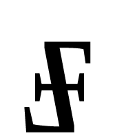
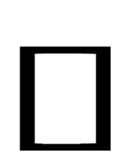
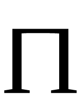

# Nioshe kaz langve hilana

Introduction to the Hylian language

&nbsp;&nbsp;
&nbsp;&nbsp;
&nbsp;&nbsp;

The purpose of the Hylian Language Institute is to educate people on the grammar and history of the Hylian language. In the land of Hyrule, Modern Hylian takes a role similar to that of English in today's world. It is the official language of goverment, and all proceedings are conducted in Hylian. It is also the preferred language of commerce throughout most of the continent. All educated people speak the Hylian laguage and it forms a common ground between diplomats, scientists, and ordinary citizens. Most people speak Hylian natively, but many also speak it as a second language. One reason that Hylian has become so prevalent is simply the influence that Hyrule has in the continent. It is the largest economic power and is often the center of important diplomatic functions. Also, the Hylian Language Institute has played a significant role in the spread of Hylian. It is a group of citizens, professors, and government employees who frequently gather to review the state of the language. They have standardized the grammar based on the most widely accepted common usage, and that grammar is taught in all schools and universities. Even the lowest on the social ladder speak Hylian in almost the same way, there is no "King's Hylian". This is quite unusual in most kingdoms. The members of the Language Institute established schools and centers to educate all citizens in the language. All citizens of Hyrule are entitled to basic education in grammar. The Institute frequently modifies rules to conform to common usage, they do not try to restrict the growth of the language. This freedom is what has allowed Hylian to become so dominant.

## History of Hylian

The Modern Hylian laguage is derived from the language spoken by the ancient tribes that first inhabited Hyrule nearly three thousand years ago, called Proto-Hylian. Hylian was unique because it is one of the first languages known to have developed an alphabet. The modern Hylian alphabet has changed little in the past thousand years. Many modern languages use the Hylian aplhabet to represent their own languages.

The development and evolution of Hylian follwed a similar path as the Indo-European languages on Earth. In fact, Hylian grammar and structure closely resembles that of many Indo-European languages such as Latin and Greek. This is very unusual. One would expect a language that developed on another world to be completely alien and unrelated to anything on earth. However, this is not the case. Hylian has undergone what can be called independent parallel development. Its language structure developed in much the same way as Proto-Indo-European did on earth. Theories exist as to why this is so. The most plausible theory supporting independent parallel development is the similarity of the cultures and the region. The Hylian continent is geographically similar to the Indo-European area of earth. Their climates are similar and their geographies are similar. Also, the cultures have developed in much the same way, with similar values and religions. Logic suggest that two species who are almost biologically identical and have similar cultures would develop similar languages. However, this could simply be one huge coincidence.

Proto-Hylian was the first ancestor to modern Hylian. It is the first form of communication that could effectively be called a language. It was simply a way for the people in the area to comunicate with each other. Most of the tribes actually spoke the same language, which helped foster unity and peace over time. Proto-Hylian would be considered quite primitive by modern standards. It had no alphabet or standard gramar rules, it was simply a means of communication. Proto-Hylian was entirely oral, and did not develop a written form for quite some time.

Ancient Hylian developed when the tribes began to coalesce into a single culture. They formed what could be called a kingdom, but not like modern kingdoms. There was a single leader who influenced the independent tribes and chiefs. Ancient Hylian was the first to develop a written form. Unlike Modern Hylian, Ancient Hylian used heiroglyphics and ideograms to write. Tiny pictures and characters represented ideas, not sounds. They would be similar to the Ancient Egyptian Heiroglyphics. Ancient Hylian became the binding force among the tribes that would eventually form the kingdom and language we know today.

Old Hylian was a remarkable evolution in the language. It gradually replaced ideograms with phonetic characters. The aplhabet no longer represented ideas, but sounds. Old Hylian became standard as the kingdom of Hylia formed. It was the first central government that combined all the tribes, which by now were considered a single people. Hylia was similar to Ancient Rome, only smaller. For almost a thousand years, Hylia was the intellectual center of the continent and became the largest power.

Middle Hylian continued the evolution of the language. It eventually adopted the alphabet that is used today. This period saw the expansion of the language to areas outside of Hylia. An equivalent to the Renaissance ocurred during this period, which only developed the language further.

Modern Hylian emerged as a language during the transition from Hylia to Hyrule. The orginal Hylian kingdom was absorbed into the larger country of Hyrule, which included the original Hylian tribes and the surrounding peoples in the area. This outside influence worked its way into the hylian language, which eventually formed what Hyrulians speak today. It is similar to Modern English in that Modern Hylian contains many words and influences from other languages.

## Why I Created This Language

Of course, we all know that the Hylains and the land of Hyrule don't really exist. But it's fun to imagine what kind of world they live in. I have read so many stories, and seen so many drawings of the Zelda universe. But there was always one thing that I wanted to see: a language for the Hylians. Of course they wouldn't speak English or Japanese, they're from another world. So it only seemed natural to me to invent a language for them. There are a few Zelda sites out there that had "Hylian dictionaries". But these really said nothing about the languages. They were just a random collection of words that people threw together. None of them really meant anything. I decided to take the next step and create an actual language from scratch. A bunch of words don't mean anything unless there are rules and customs to tie them together. I always get a lot of questions like, "What's the word for -----?" Whenever people want to know about a foreign language, they want to know what certain words mean. So some would think that I would have to come up with a huge list of words. But I took the opposite path. Remember, words don't mean anything unless there are grammar rules to back them up. So I started with the grammar first. Grammar is the hardest part of inventing a language. First of all, a person obviously has to have a certain mastery of English grammar (or whatever native language they might speak) in order to create a new language. Fortunately, I do consider myself fairly competent in English mechanincs and grammar.

The first thing I had to do when creating the Hylian grammar was to actually determine which grammatical functions I would use and define, such as adjectives, nouns, adverbs, etc. I basically used basic elements that are not only present in English grammar, but in the grammar of almost all human languages. It helps to have in interest in foreign languages. I, for example, speak Spanish, I am currently studying Arabic, and I plan on taking Chinese and Japanese. One major inspiration for Hylian was the artificial language (or as linguists call them "auxilliary languages") Esperanto. It was a language that was invented by Dr. L. L. Zamenhof in 1887. It's purpose was to foster peace between countries by creating a language that was easy to learn, and most of all, give everyone a linguistically equal footing. Everyone would be speaking it as a second language, so no one would have the advantage of being a native speaker. Obviously, this idea didn't really take off, considering that only linguistic geeks have ever heard of Esperanto. But Esperanto did give me a whole bunch of ideas to use for Hylian. One major characteristic of Esperanto is that all words are "grammar-coded". That means that each word has a certain ending that tells what part of speech it is and what function it plays in a sentence. I used this inspiration for Hylian. For example, Hylian singular nouns end in -e, and plural nouns end in -ën. This is true for all nouns, except for some proper nouns (names like "Zelda", "Link", etc.). And adjectives are similar too: singular adjectives end in -a, and plural adjectives end in -an. The list goes on forever, but you get the idea. Basically, I used my own creativity to create the grammar. Many of the Hylian grammar rules are similar to English and other Indo-European languages.

Thinking of words is the next hardest part. There are a lot of words, and I have to think of each one. But thinking of a word isn't just coming up with something at random. I have to think of how it will conform to the rules, and how the word will sound. Ease of pronunciation is also an important thing to consider. Also, I try to make words sound foreign. If it sounds too much like English, then it sounds corny. Some words are inspired by Romance languages and Latin. For example, the Hylian word "toëre", which means "world", was inspired by the Spanish "tierra" and Latin "terra", which mean "earth". Notice the connection? Sometimes I use languages like Japanese for inspiration. For example, the Hylian "sajana.i", which means "goodbye", is based on the Japanese "ja ne", which is a colloquialism for "goodbye". Also, the Hylian "oha.io", which means "hello", came from the Japanese "ohayo", which means "good morning". Of course, sometimes words just come out of nowhere. Like the Hylian "jhatag", for "to speak", just sounded cool to me.

The alphabet was another prime concern. It took me a while to figure that out. I tried to use some of the glyphs seen on walls and doors in Ocarina of Time as a basis for some of the letters. You'll notice that all the letters are squarish or rectangular. They looked like that in the game, so I decided to go with it. Creating the alphabet has taken a while. I am still perfecting it. When I originally created it, I thought it looked good. But as the alphabet became second-nature to me, I realized that some of the letters looked too much like our alphabet. So I changed a few of the letters. Then after a little longer, I still thought they looked too much like English, so I changed them again. The changes aren't major, but they are significant.The only real changes to the letters were addition or removal of lines. So if you really want to get into this language, I recommend checking every now and then to see if I tweaked the alphabet, grammar stays pretty much the same.

That's really all I have to say about this. If you want to really get into the language, then read the grammar sections. I'll tell you right now: this isn't going to be something that will be completed overnight. developing a real language is going to take me a while. But it'll get done eventually .
